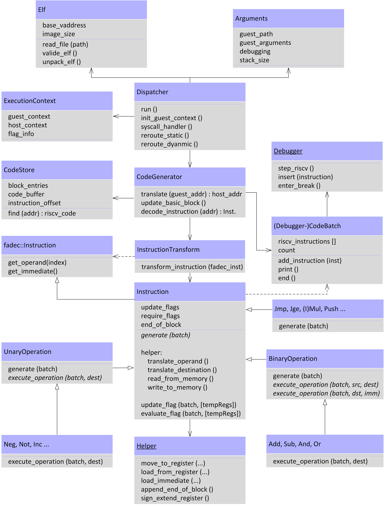
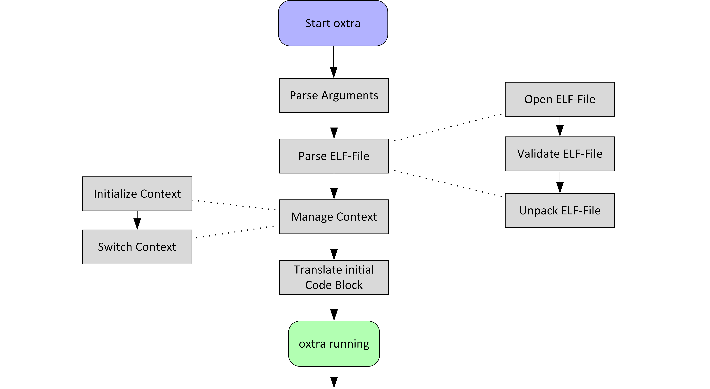
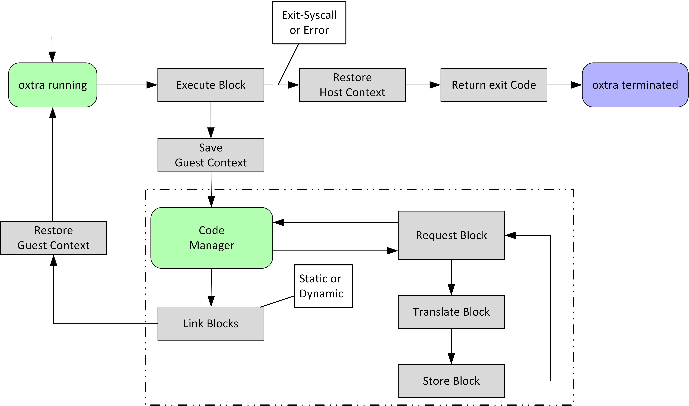

# Contributing to oxtra

Thank you very much for the interest in oxtra and for wanting to become a part of the community &mdash; you are great :heart: !

As already stated in the [README](README.md), this project is currently not under active development and we welcome any ideas, bug reports, documentation improvements, or any other things you can come up with. In almost every case, the best way of reaching us is by [creating an issue](https://github.com/oxtra/oxtra/issues/new/choose).

This file tries to explain as much of oxtra as possible while still being rather short. If you are interested in the inner workings, you can look into [our written report](https://github.com/oxtra/oxtra/blob/master/documentation/paper/Paper.pdf), explaining a lot of the internal mechanics, fundamentals of RISC-V and reasoning behind some of our decisions. 

If you haven't already, please read the [code of conduct](CODE_OF_CONDUCT.md) before contributing to oxtra.

## How to create a Bug Report / Issue
As the community of this project is rather small, you can simply create an issue for any problems you face. As we are not actively maintaining this project, our response could take a week or two. If we haven't acknowledged you by then, you are free to ping the issue.

There are no formal templates available, but please keep the following points in mind:
* Have an easy to understand and descriptive title
* Try to be concise, while still giving us as much information as possible
* Try to simplify your use case (e.g. delete unnecessary code)
* Describe the steps required to reproduce your issue
* Include possible error messages you get as text and run the program with as much logging as possible

## Coding Conventions

### Development Procedures
If you would like to work on a problem yourself, it is best if you create an issue for it and tell us that you are working on it. You can start by forking the project and creating a pull request. You can also ask us to give you commit access directly.

Try to keep the code changes relevant to your issues / PRs. Ideally, you should create an issue and corresponding PR for every feature you implement. Large PRs have the chance of not being accepted as it becomes more difficult for the maintainers to review your changes and understand your reasoning. If you notice that your PR becomes too big, you should split it up. 

#### Configure the Development Environment
The [README](README.md) file should explain everything that is required to setup the development environment. It is probably best if you just use the available docker container. You can make the changes in this container persistent and available to your normal filesystem with the `-v` flag. For example, if you want to store the `/oxtra` folder of your docker container onto your desktop you could start the container like this:

    $ docker run -v /home/user/desktop/oxtra:/oxtra -it plainerman/qemuriscv:oxtra /bin/bash

The colon separates the local path from the container path.

#### Additional Notes
It is important, that if you make modifications to the source code itself that you test your features, as described in [testing](#testing). A PR containing code changes with failing or missing tests will not be accepted.

### Styling and Code Guidelines
There are no complete, written down styling guidelines. We discussed a lot about it. In essence, try to be consistent and look at existing code. Still, we would highly appreciate if you would keep the following things in mind:
* We use tabs, not spaces
* Our opening curly brackets are in the same line
* Classes are UpperCamelCase
* Functions and variables are snake_case
* Try to document as many functions as possible, especially those that are public
* Use auto pointers and similar modern C++ features

#### Commit Messages
The first line of the commit message should be as short as possible while still being descriptive. Then you can and should add as much relevant information as possible. Commit messages are commands to the code base, so they should look like "Fix register mapping for IMUL".

If applicable, you can and should reference the issue id in your commit.  

### Testing
In oxtra, we use two different kinds of tests: unit and integration tests.

Unit tests are written in C++ and check whether given functions / units behave correctly. Those are written with [Catch2](https://github.com/catchorg/Catch2), are found in [test/oxtra](https://github.com/oxtra/oxtra/tree/master/test/oxtra), and can be executed with the following command.

    $ qemu-riscv64 test/unit_tests

Since oxtra has a lot of things that can go wrong (and binary translation makes testing and debugging hard) , we decided to test the binary against pre-defined input and output. To run those tests, you need to have [shelltestrunner](https://github.com/simonmichael/shelltestrunner) installed (which our docker container already contains).

Those tests can be executed with

    $ shelltest --all --timeout=30 --threads=4 test/integration/*.otest --with='qemu-riscv64 oxtra'

You can find the definition of those tests in the [test/integration](https://github.com/oxtra/oxtra/tree/master/test/integration) folder.

## Description of Internals

The following diagrams can help you getting started understanding the internal structure. For a textual description of those graphics and more details, you can take a look into the [written report](https://github.com/oxtra/oxtra/blob/master/documentation/paper/Paper.pdf).

### UML Architecture Diagram

### Lifecycle Diagram
#### Initialization Process

#### Active Translation

