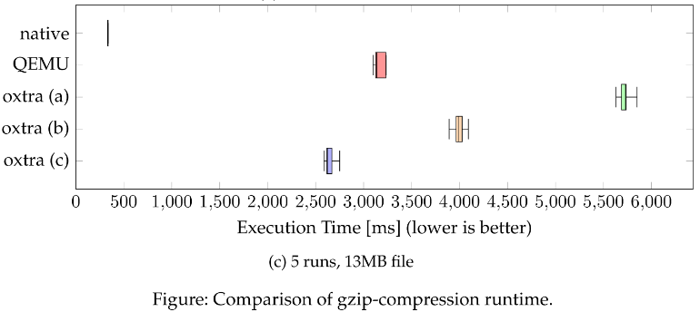
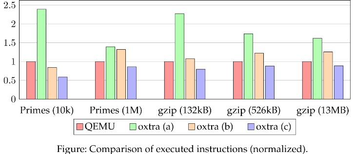
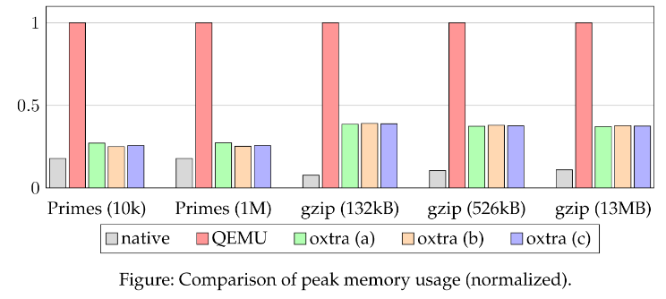

# oxtra &mdash; x86 to RISC-V Translator

 

oxtra is a lightweight and easy to use binary translator capable of executing x86-64 programs on RISC-V.

[RISC-V](https://riscv.org/) is a powerful albeit relatively new Reduced Instruction Set Computer (RISC)
Instruction Set Architecture ([ISA](https://riscv.org/wp-content/uploads/2017/05/riscv-spec-v2.2.pdf)), focusing on simple and concise instructions. To this
day, adoption is still an issue especially since RISC-V is mostly unsupported by leading
software manufacturers. One way around this problem is dynamic binary translation of
existing x86 (Intel / AMD) executables.

oxtra allows you to execute (legacy) programs compiled for x86 64bit on your 64bit RISC-V computer.  As other, more feature-complete binary translators for RISC-V exist (most notably [QEMU](https://wiki.qemu.org/Documentation/Platforms/RISCV)), the aim of oxtra is not to fully support all programs, but to focus on performance and optimization (see [performance comparison](#performance-comparison)). 

Currently, oxtra only supports a small subset of x86 instructions and only works with statically linked programs. The ubiquitous glibc is not supported, hence we have created our own fork of [musl-gcc](https://github.com/oxtra/musl-gcc) that allows you to compile many of your programs with [musl-libc](https://www.musl-libc.org/).  If you would like to overcome some of these issues, all contributions are very welcome and we would love to see oxtra becoming a more widespread and feature-complete binary translator.

## Project Status and Contribution
oxtra has been developed in the course of about half a year as a university project. Although we are all very passionate about this project, as of now we do not really find the time to contribute to oxtra. 

This is why all contributions and all directions you have for this project are welcome and highly appreciated. Just create an issue and we will be happy to discuss your ideas and probably give you commit access directly. Please read the [code of conduct](CODE_OF_CONDUCT.md) and the [contribution guidelines](CONTRIBUTING.md) before becoming a part of the community.

## Installing and Building the Project
If you happen to have a RISC-V computer (which you probably don't), you can just head to the [releases page](https://github.com/oxtra/oxtra/releases), and download the latest oxtra executable. 

This can be done by e.g. executing the following code:

    $ wget https://github.com/oxtra/oxtra/releases/download/v1.0.1/oxtra
    $ chmod +x oxtra

 See [usage](#usage) for more information and enjoy :heart:. 

### Setting up and building oxtra on a typical x86 64bit Computer
For all others on a more conventional computer, you have to emulate RISC-V with qemu. You can either [install the required programs on your own](https://risc-v-getting-started-guide.readthedocs.io/en/latest/linux-qemu.html) (which we would not recommend) or use our available [docker image](https://github.com/plainerman/qemuriscv/). The following steps will guide you through on how to get started with installation and development inside a docker container.

Before you continue, please install docker. For that, consult [the official documentation](https://docs.docker.com/get-docker/).

The following docker command downloads the latest oxtra development image from docker-hub and starts a bash-session in an environment that allows you to run and build oxtra. Grab a cup of coffee, as this can take some minutes :coffee:.

    $ docker run -it plainerman/qemuriscv:oxtra /bin/bash

This session you have just started is still x86 but it comes with qemu (required to emulate RISC-V and run oxtra) and a gcc that outputs RISC-V assembly (to build oxtra). 

The easiest way to continue, is building oxtra by executing the following commands (in the bash shell that has just opened up):

    $ git clone https://github.com/oxtra/oxtra.git
    $ cd /oxtra
    $ cmake -D CMAKE_BUILD_TYPE=release -D CMAKE_C_COMPILER=/opt/riscv/bin/riscv64-unknown-linux-gnu-gcc -D CMAKE_CXX_COMPILER=/opt/riscv/bin/riscv64-unknown-linux-gnu-g++ .
    $ make

## Usage
Regardless of whether you have a RISC-V 64 bit Linux, or use our docker container, oxtra can
be executed by simply invoking:

    $ ./oxtra <path/to/x86-64-program> [-a "arguments"]

The above line executes the specified x86-64 elf binary and (if arguments have been added), passes those to the **guest application**. It is often useful to enable logging. Every logging type can be enabled/disabled separately. To enable all types, `-1` can be passed with:

    $ ./oxtra <path/to/x86-64-program> [-a "arguments"] -l -1

For more information, you can consult the usage command by entering:

    $ ./oxtra --usage

    Usage: oxtra [-?V] [-a "ARGUMENTS..."] [-d DEPTH] [-e SIZE] [-i SIZE]
                [-l LEVEL] [-o SIZE] [-s SIZE] [--args="ARGUMENTS..."]
                [--debug=MODE] [--flag-depth=DEPTH] [--lentry-size=SIZE]
                [--linst-size=SIZE] [--log-level=LEVEL] [--loffset-size=SIZE]
                [--stack-size=SIZE] [--help] [--usage] [--version] x86_EXECUTABLE

Or, for more detailed information, the help page:

    $ ./oxtra --help

    Usage: oxtra [OPTION...] x86_EXECUTABLE
    oxtra -- oxtra x86 translator
    
      -a, --args="ARGUMENTS..."  Specify the arguments that will be passed to the
                                 x86 executable. The default is no arguments
          --debug=MODE           Specify to attach and enable the debugger.
                                 0=disabled, 1=lightweight, 2=riscv-enabled. The
                                 default is 0.
      -d, --flag-depth=DEPTH     The recursion depth of the flag prediction. The
                                 default is 4.
      -e, --lentry-size=SIZE     The size of the list containing block entires.
                                 Limit for consecutive block entries. The default
                                 is 64.
      -i, --linst-size=SIZE      The size of the list containing instructions.
                                 Limit for generated RISCV instructions in a block.
                                 The default is 4096.
      -l, --log-level=LEVEL      Specify the attributes to log. 0x1=riscv, 0x2=x86,
                                 0x4=translated, 0x8=reroutes, 0x10=syscalls,
                                 0x20=return value. Multiple log entries can be
                                 specified that will be OR'd. The default is none
                                 (0).
      -o, --loffset-size=SIZE    The size of the list containing offset. Limit for
                                 consecutive offsets. The default is 512.
      -s, --stack-size=SIZE      The size of the stack in decimal. The default size
                                 is 2MiB (0x200000).
      -?, --help                 Give this help list
          --usage                Give a short usage message
      -V, --version              Print program version
    
    Mandatory or optional arguments to long options are also mandatory or optional
    for any corresponding short options.
    
    Thanks for your interest in oxtra :).
    
    Report bugs to https://github.com/oxtra/oxtra.

## Run the Tests
To run the tests, clone and build the project locally. As of now, it is best if you do this in the docker image, as there is everything configured (see [docker setup](#setting-up-and-building-oxtra-on-a-typical-x86-64bit-computer)). 

    $ cd /oxtra
    $ qemu-riscv64 test/unit_tests
    $ shelltest --all --timeout=30 --threads=4 test/integration/*.otest --with='qemu-riscv64 oxtra'

## Execute an actual Program (gzip)
If you were able to execute the unit and integration tests above, you have already executed many smaller programs (with shelltest) and more notable, compressed a file with [gzip](http://www.gzip.org/). You can take a look into the `test/integration` folder, where actual executions are tested. [This test](https://github.com/oxtra/oxtra/blob/master/test/integration/gzip.otest), is the most ambitious one, and it shows the capabilities of oxtra. To run this test manually and get a better understanding of oxtra you can execute the following commands.

    $ ./oxtra test/resources/musl/gzip -a "--help"

    Usage: gzip [OPTION]... [FILE]...
    Compress or uncompress FILEs (by default, compress FILES in-place).
    ...

To compress an actual file, you would have to execute the following command:

    $ ./oxtra test/resources/musl/gzip -a "-c test/resources/dump_me.cpp"

    ?D????dump_me.cpp mO?n ...

### Performance Comparison
As stated above, oxtra was developed to be faster than the very versatile and more complete competitor qemu. In theory, this should be easily achievable as qemu uses an intermediate language to quickly support many different platforms at the cost of individual optimization.

The following benchmarks show qemu compared to three different versions of oxtra (a,b,c), where c is version 1.0.1. The current version, consistently beats qemu in our toy-examples.

## Support
If you need any support, don't hesitate to open an issue. As this project is not actively maintained by us anymore, it may take some time for us to respond and or to reproduce your issue. You can expect an answer from us within a week or two. 

Further, you can always take a look at [our written report](https://github.com/oxtra/oxtra/blob/master/documentation/paper/Paper.pdf) about this project.

## Authors and Acknowledgement
oxtra was developed by Knud Haase, Björn Boss Henrichsen, Michael Plainer, and Justus Polzin.

We would like to thank our advisor Alexis Engelke, as he supported us throughout the development with great tips and has taught us a lot.
